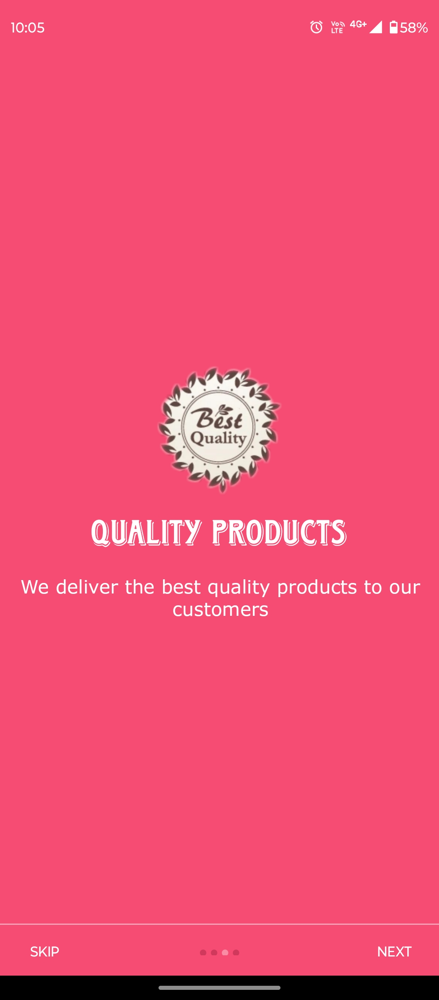
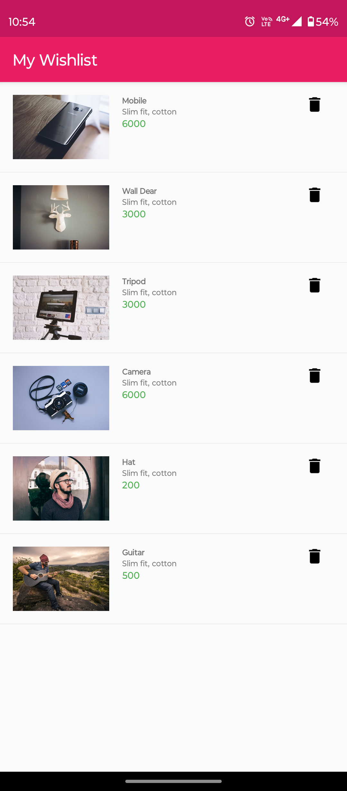

# Shopify Ecommerce Android App 
   
### E-Commerce Android Platforms App 
  
  -   Android Platforms based E-Commerce application to provide a simple and easy interface to the user, 
so that the users can easily explore various products and their details smoothly even with or without login and signup into the app,

  -   It also provides the functionality of wishlist and cart to save the favourite items. 

  -   Google and Facebook account authentication is also provided using firebase, which provides a fast and better method to login and signup securely. 

### App Flow Diagram 
   -  This Diagram shows the flow diagram of our app with all the steps and processes, it is just a blue print of app functionality. 
    
       

### Welcome Activity 
  **Welcome Screens** 

  -   These screens are only visible to the users when they install the app, this makes a good first impression on the users.

|Screen-1|Screen-2|Screen-3|Screen-4|Screen-5|
|----|----|----|----|----|
|||||| 

### Category Tabs
  **Home** 

  -  It is the first page of our app. It consists of some basic information about products categories which will be available for online shopping through this app.

  **Offers** 

  -  It contains the new and the best offers and discounts on the products, which are provided by the store, company or small businesses directly to the user.

  **Electronics** 

  -  It contains all the categorised electronics items under a single tab.

  **Lifestyle** 

  -  It displays all the lifestyle products like cloths under a single tab layout.

  **Home Appliances** 

  -  It provides all the products required in a home under the tab known as home appliances.

  **Books and more** 

  -  It provides all the products and items related to study materials like books, notebooks etc.

|Offers|Electronics|Lifestyle|Appliances|Books & More| 
|----|----|----|----|----|
||||||

## Cart, Wishlist & Orders 
  **Menu** 
  -  It provides all the functionality of app under a single tray, it enables easy and fast navigation to different parts of the application. 
  
  **My Cart** 

  -  Cart is a functionality which provides the users to handle and maintain the products which they want to buy. 

  **My Orders** 

  -  This provides list of all the orders that had been placed by the users and the list of pending orders..

  **Product Description** 
  -  It provides all the description of the product selected by user to know more about it, like different view angle of item, ratings, price, discount etc.

  **My Wishlist** 

  -  Wishlist is the functionality which provides the users to handle and maintain the products which they like and wish to buy in future.

|Main Menu|My Cart|Orders|Description|Wishlist|
|----|----|----|----|----|
||||||

## Account & Profile 

  **My Account** 

  -  This helps the user to view and edit their account and profile on the shopezze app. 

  **Login** 
  -  This module helps the existed customers to login to their respective accounts securely which is necessary for the customers before proceeding to the order payment.

  **Signup** 
  -  New users can register with the help of this module either creating new account or using the facebook and google account authentication. 

  **Addresses** 
   -  This provides all addresses to add and use for the delivery purposes by the user.

  **Forgot Password** 
  -  Users can reset their password using otp on their registered email ID. 

|My Account|Signup|Login|Addresses|Forgot Pass|
|----|----|----|----|----|
|||||| 

## Other Options 
  **Search**
  - this allows the users to search the particular products and items they wants to buy

  **About us**
  -  It provides the details about the store, company or business who owns the app.

  **Contact us** 
  -  This helps the users to directly contact the authorised members.